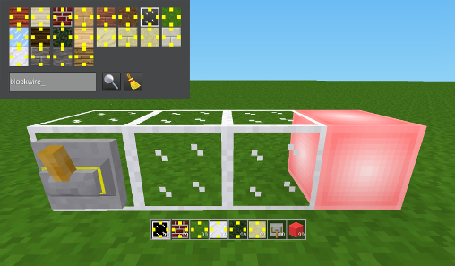

# Mesecons Blockwire

**Description:** The mod »mesecons_blockwires« is an extension to the mod package »mesecons« (http://mesecons.net/ - see below). It adds blocks, which look like default nodes (for example »dirt_with_grass«) but pass the signal from switches, treadplates, etc. in all directions. So you can build more elegantly because there are no open wires to see.

**Use:** Search in the inventory for »blockwires« (inventory image with four yellow squares). Create for example a wall and add a light block and a switch to your structure. Hit the switch to see what happens ...

**Install**: Unzip the downloaded folder and rename it to »mesecons_blockwires« (if necessary). Copy the folder into your »luanti/mods« folder.

**Depends:** This mod requires »default« (part of »[minetest_game](https://content.luanti.org/packages/Minetest/minetest_game/)«) and »[mesecons](https://content.luanti.org/packages/Jeija/mesecons/)«.  

**Known Issues:** There are currently no recipes for the blocks. Therefore, they can only be accessed in creative mode or with »giveme« (example: /giveme mesecons_blockwires:wire_glass_off). You can not see directly from the outside whether the blocks are conducting. This can lead to unwanted connections. The only way to distinguish a blockwire from a regular block is to press F5 and hover over the object to get its name.

**License:**  
Author: This mod was made by [Norbert Thien, multimediamobil – Region Süd (mmmsued)](https://minetest-modding.weebly.com/), 2024  
Code: The LGPLv3 applies to all code in this project.  
Media: The CC-BY-SA-3.0 license applies to textures and any other content in this project which is not source code.  
Notice: This mode uses concepts and code from the mod »mesecons« and textures from the mod »default« (»minetest_game«).

#

    ########################################################################
    ##  __    __   _____   _____   _____   _____   _____   _   _   _____  ##
    ## |  \  /  | |  ___| |  ___| |  ___| |  ___| |  _  | | \ | | |  ___| ##
    ## |   \/   | | |___  | |___  | |___  | |     | | | | |  \| | | |___  ##
    ## | |\__/| | |  ___| |___  | |  ___| | |     | | | | |     | |___  | ##
    ## | |    | | | |___   ___| | | |___  | |___  | |_| | | |\  |  ___| | ##
    ## |_|    |_| |_____| |_____| |_____| |_____| |_____| |_| \_| |_____| ##
    ##                                                                    ##
    ########################################################################

MESECONS by Jeija and contributors

Mezzee-what?
------------
[Mesecons](http://mesecons.net/)! They're yellow, they're conductive, and they'll add a whole new dimension to Minetest's gameplay.

Mesecons is a mod for [Minetest](http://minetest.net/) that implements a ton of items related to digital circuitry, such as wires, buttons, lights, and even programmable controllers. Among other things, there are also pistons, solar panels, pressure plates, and note blocks.

Mesecons has a similar goal to Redstone in Minecraft, but works in its own way, with different rules and mechanics.

OK, I want in.
--------------
Go get it!

[DOWNLOAD IT NOW](https://github.com/minetest-mods/mesecons/archive/master.zip)

Now go ahead and install it like any other Minetest mod. Don't know how? Check out [the wonderful page about it](https://wiki.minetest.net/Mods) over at the official Minetest Wiki. For your convenience, here's a quick summary:

1. If Mesecons is still in a ZIP file, extract the folder inside to somewhere on the computer.
2. Make sure that when you open the folder, you can directly find `README.md` in the listing. If you just see another folder, move that folder up one level and delete the old one.
3. Open up the Minetest mods folder - usually `/mods/`. If you see the `minetest` or folder inside of that, that is your mod folder instead.
4. Copy the Mesecons folder into the mods folder.

Don't like some parts of Mesecons? Open up the Mesecons folder and delete the subfolder containing the mod you don't want. If you didn't want movestones, for example, all you have to do is delete the `mesecons_movestones` folder and they will no longer be available.

There are no dependencies - it will work right after installing!

How do I use this thing?
------------------------
How about a [quick overview video](https://www.youtube.com/watch?v=6kmeQj6iW5k)?

Or maybe a [comprehensive reference](http://mesecons.net/items.html) is your style?

An overview for the very newest of new beginners? How does [this one](http://uberi.mesecons.net/projects/MeseconsBasics/index.html) look?

There is also a [wiki page](https://wiki.minetest.net/Mods/Mesecons) dedicated to this mod.

Want to get more into building? Why not check out the [Mesecons Laboratory](http://uberi.mesecons.net/), a website dedicated to advanced Mesecons builders?

Want to contribute to Mesecons itself? Check out the [source code](https://github.com/minetest-mods/mesecons)!

Who wrote it anyways?
---------------------
These awesome people made Mesecons possible!

| Contributor     | Contribution                     |
| --------------- | -------------------------------- |
| Hawk777         | Code for VoxelManip caching      |
| Jat15           | Various tweaks.                  |
| Jeija           | **Main developer! Everything.**  |
| Jordach         | Noteblock sounds.                |
| khonkhortistan  | Code, recipes, textures.         |
| Kotolegokot     | Nodeboxes for items.             |
| minerd247       | Textures.                        |
| Nore/Novatux    | Code.                            |
| RealBadAngel    | Fixes, improvements.             |
| sfan5           | Code, recipes, textures.         |
| suzenako        | Piston sounds.                   |
| Uberi/Temperest | Code, textures, documentation.   |
| VanessaE        | Code, recipes, textures, design. |
| Whiskers75      | Logic gates implementation.      |

There are also a whole bunch of other people helping with everything from code to testing and feedback. Mesecons would also not be possible without their help!

Alright, how can I use it?
--------------------------
All textures in this project are licensed under the CC-BY-SA 3.0 (Creative Commons Attribution-ShareAlike 3.0 Generic). That means you can distribute and remix them as much as you want to, under the condition that you give credit to the authors and the project, and that if you remix and release them, they must be under the same or similar license to this one.

All code in this project is licensed under the LGPL version 3 or later. That means you have unlimited freedom to distribute and modify the work however you see fit, provided that if you decide to distribute it or any modified versions of it, you must also use the same license. The LGPL also grants the additional freedom to write extensions for the software and distribute them without the extensions being subject to the terms of the LGPL, although the software itself retains its license.

No warranty is provided, express or implied, for any part of the project.
